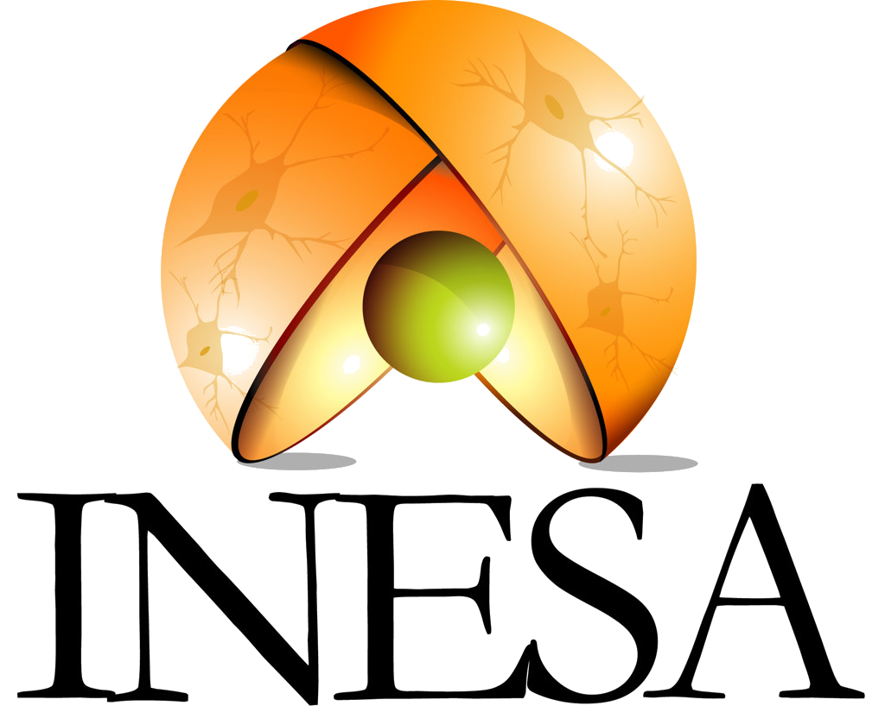
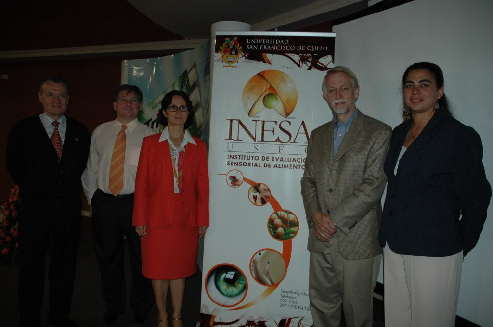
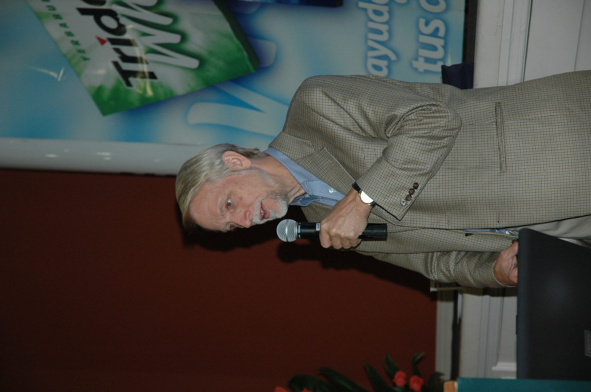
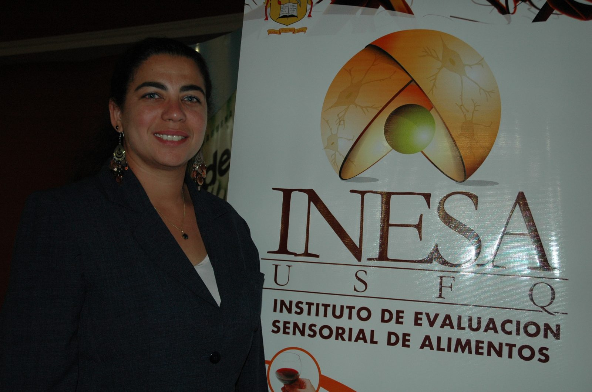

<p align="center">
  
</p>

<h1 align="center">INESA~C.A — Sitio Web</h1>

<p align="center">
  <strong>Instituto de Evaluación Sensorial Alimentos</strong><br />
  Houston, TX · USA
</p>

<p align="center">
  
  
  
  
</p>

---

Sitio institucional de **INESA~C.A**, reconstruido con **Nuxt 4** y preparado para una futura plataforma de capacitaciones online. Incluye información de servicios, galería fotográfica de eventos y laboratorio, y contacto en tres idiomas.

## Vista previa

<p align="center">
  
  
  
</p>

## Características

- **Multilingüe** — Español (por defecto), inglés y francés con `@nuxtjs/i18n`
- **Galería interactiva** — 118 fotos en categorías: destacadas, eventos, análisis e institucional
- **Diseño responsive** — Navegación móvil, hero, tarjetas de servicios y lightbox
- **Capacitaciones** — Página `/courses` lista para integrar LMS
- **SEO y branding** — Meta tags, favicon y logo transparente INESA

## Páginas

| Ruta | Descripción |
|------|-------------|
| `/` | Inicio — hero, servicios, galería y contacto |
| `/about` | Quiénes somos — misión, enfoque y valores |
| `/services` | Servicios de evaluación sensorial y consultoría |
| `/gallery` | Galería completa con filtros y lightbox |
| `/courses` | Capacitaciones online (próximamente) |
| `/contact` | Formulario y datos de contacto |

Rutas en inglés y francés: `/en/...`, `/fr/...`

## Galería

<p align="center">
  
  
  
  
</p>

## Stack tecnológico

| Tecnología | Uso |
|------------|-----|
| [Nuxt 4](https://nuxt.com) | Framework full-stack |
| [Vue 3](https://vuejs.org) | UI reactiva |
| [@nuxtjs/i18n](https://i18n.nuxtjs.org) | Internacionalización |
| CSS custom | Diseño institucional (Enriqueta + Muli) |

## Inicio rápido

```bash
# Clonar el repositorio
git clone https://github.com/NezbiT/Inesa-web.git
cd Inesa-web

# Instalar dependencias
npm install

# Servidor de desarrollo
npm run dev
```

Abrir [http://localhost:3000](http://localhost:3000) (Nuxt elige otro puerto si 3000 está ocupado).

### Scripts

| Comando | Descripción |
|---------|-------------|
| `npm run dev` | Servidor de desarrollo con HMR |
| `npm run build` | Build de producción |
| `npm run preview` | Vista previa del build |
| `npm run generate` | Sitio estático (SSG) |

## Estructura del proyecto

```
├── app/
│   ├── pages/           # Rutas: index, about, services, gallery, courses, contact
│   ├── components/      # Layout, home, gallery
│   ├── composables/     # useGallery, useLocaleArray
│   ├── layouts/         # default.vue
│   └── assets/css/      # Estilos globales
├── i18n/locales/        # es.json, en.json, fr.json
├── public/
│   ├── logo-inesa.png   # Logo transparente (favicon + branding)
│   └── images/gallery/  # 118 fotos del instituto
├── shared/
│   ├── data/            # gallery.ts, courses.ts
│   └── types/           # Tipos TypeScript
└── nuxt.config.ts
```

## Contacto

- **Email:** yamilaec@yahoo.com
- **Ubicación:** Houston, TX, USA

## Licencia

Proyecto privado de INESA~C.A. Todos los derechos reservados.

---

<p align="center">
  <br />
  <em>Excelencia en evaluación sensorial y ciencia del consumidor</em>
</p>